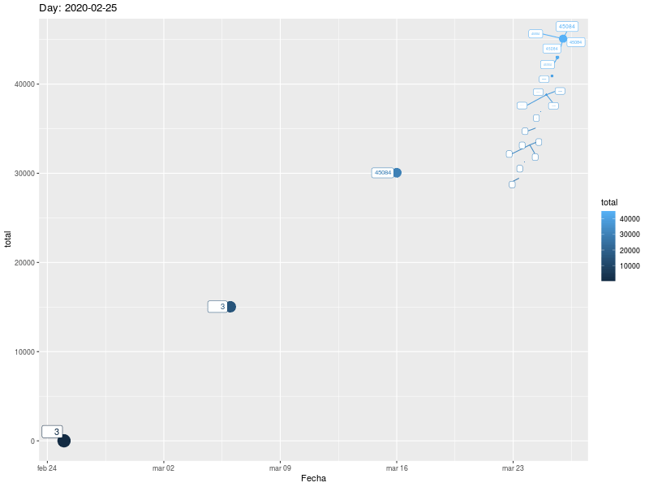

Este artículo es una actualización diaria de la evolución de los casos de COVID-19 en España, con datos oficiales del Ministerio de Sanidad recogidos por [el Datadista](https://github.com/datadista/datasets). Sucede a [este artículo](https://rpubs.com/jjmerelo/585182), que se deja de publicar a 24 de marzo de 2020.


```{r setup, include=FALSE}
load("covid-19-es.Rda")
library(ggplot2)
library(ggthemes)
```

## Análisis de salidas

¿Cuál es la relación entre los casos reportados y la cantidad de personas que ya han fallecido o sido dadas de alta? Trazaremos los casos frente al las altas y fallecimientos.

```{r salidas, warning=FALSE}
ggplot(data,aes(x=Fecha))+geom_line(aes(y=casos,color="Casos"))+geom_line(aes(y=salidas,color="Salidas"))+theme_tufte()

```

Cabe notar que las primeras salidas no se dieron hasta pasar más de dos semanas desde los primeros casos, lo que posiblemente quiere decir que hay muchas altas que no se están teniendo en cuenta (o fallecimientos).

Representamos también de forma gráfica y animada la evolución de los casos totales (casos - altas - decesos). Cabe notar que muchas altas no se anotarán ni se publicarán, ya que los informes recogen sólo las altas hospitalarias.



Cabe indicar que, a pesar de haberse ralentizado considerablemente, a principio de abril todavía no desciende esa curva, aunque es de esperar que el número de altas esté muy subestimado.

## Análisis inicial

Una de los parámetros que es interesante conocer es el cambio con respecto al día anterior. Empezaremos por los casos nuevos

```{r casos, warning=FALSE}
ggplot(data,aes(x=Fecha,y=Casos.nuevos),na.rm = TRUE)+geom_line()+geom_point()+theme_tufte()
```

El pico de casos nuevos se alcanzó aparentemente el 31 de marzo, después de un primer pico el día 26. Aparentemente, hay cierta periodicidad en los informes de nuevos casos que habría que investigar.

Las nuevas altas por día

```{r altas, warning=FALSE}
ggplot(data,aes(x=Fecha,y=Altas.nuevas),na.rm = TRUE)+geom_line()+theme_tufte()
```

Dado que parece haber un cierto retraso en reportar los casos, realizamos la media de tres días para suavizar la curva

```{r altas.suaves, warning=FALSE}
ggplot(data,aes(x=Fecha),na.rm = TRUE)+geom_line(aes(y=Altas.nuevas,color="Dato"))+geom_line(aes(y=Altas.Avg.3,color='Media a 3'))+theme_tufte()
```

Los nuevos fallecimientos por día, junto con la media a 3 días

```{r fallecimientos, message=FALSE, warning=FALSE}
ggplot(data,aes(x=Fecha))+geom_line(aes(y=Fallecimientos.nuevos, color='Dato'))+geom_line(aes(y=Decesos.Avg.3, color='Media a 3'))+theme_tufte()
```

Hubo dos picos, uno el día 26, otro el día 2 de abril; los descensos ahora se comienzan a notar también en la media diaria a tres días, así que cabe hablar de una consolidación que llegaría, probablemente, el 3 de abril.

**Nota** A partir de hoy día 8 se elimina cualquier referencia al dato de hospitalizados e ingresos en la UCI. El proporcionado por el ministerio es un dato falso, resultante de sumar dos cantidades diferentes: personas que han sido hospitalizadas (en comunidades como Andalucía) desde el principio, o incidencia con personas que están hospitalizadas a día de hoy, o prevalencia, en comunidades como Madrid o Castilla y León.

Las [correlaciones entre diferentes series de incrementos diarios, que dan una idea más clara de los datos futuros, se encuentran en otro informe](https://rpubs.com/jjmerelo/correlaciones-diarias-es-covid-19).

## Reconocimientos

Este fichero está generado a partir de los datos elaborados por [Datadista](https://github.com/datadista/datasets) y tiene una licencia libre. Se puede generar con nuevos datos usando el script en [este repositorio](https://github.com/JJ/covid-reports).
