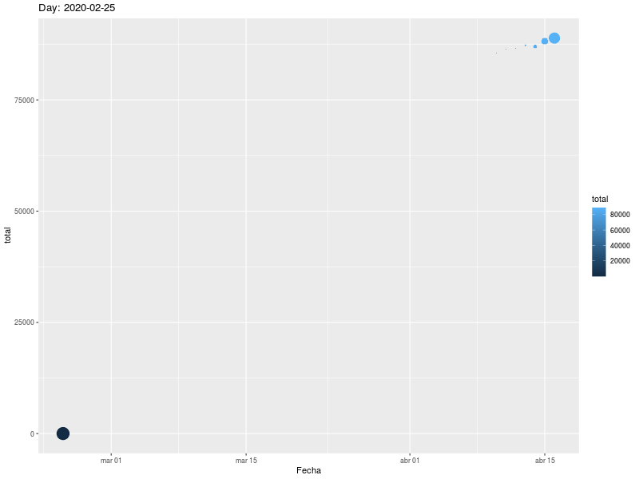

Este artículo es una actualización diaria de la evolución de los casos de COVID-19 en España, con datos oficiales del Ministerio de Sanidad recogidos por [el Datadista](https://github.com/datadista/datasets). Sucede a [este artículo](https://rpubs.com/jjmerelo/585182), que se deja de publicar a 24 de marzo de 2020.


```{r setup, include=FALSE}
load("covid-19-es.Rda")
library(ggplot2)
library(ggthemes)
```

## Análisis de salidas

¿Cuanto se tarda en llegar a una salida de la situación de infección? Trazaremos los casos frente al las altas y fallecimientos.

```{r salidas, warning=FALSE}
ggplot(data,aes(x=Fecha))+geom_line(aes(y=casos,color="Casos"))+geom_line(aes(y=salidas,color="Salidas"))+theme_tufte()

```

Cabe notar que las primeras salidas no se dieron hasta pasar más de dos semanas desde los primeros casos, lo que posiblemente quiere decir que hay muchas altas que no se están teniendo en cuenta (o fallecimientos).

Representamos también de forma gráfica y animada la evolución de los casos totales (casos - altas - decesos). Cabe notar que muchas altas no se anotarán ni se publicarán, ya que los informes recogen sólo las altas hospitalarias.



## Análisis inicial

Una de los parámetros que es interesante conocer es el cambio con respecto al día anterior. Empezaremos por los casos nuevos

```{r casos, warning=FALSE}
ggplot(data,aes(x=Fecha,y=Casos.nuevos),na.rm = TRUE)+geom_line()+geom_point()+theme_tufte()
```

El pico de casos nuevos se alcanzó aparentemente el 31 de marzo, después de un primer pico el día 26. Aparentemente, hay cierta periodicidad en los informes de nuevos casos que habría que investigar.

Las nuevas altas por día

```{r altas, warning=FALSE}
ggplot(data,aes(x=Fecha,y=Altas.nuevas),na.rm = TRUE)+geom_line()+theme_tufte()
```

Dado que parece haber un cierto retraso en reportar los casos, realizamos la media de tres días para suavizar la curva

```{r altas.suaves, warning=FALSE}
ggplot(data,aes(x=Fecha),na.rm = TRUE)+geom_line(aes(y=Altas.nuevas,color="Dato"))+geom_line(aes(y=Altas.Avg.3,color='Media a 3'))+theme_tufte()
```

Los nuevos fallecimientos por día, junto con la media a 3 días

```{r fallecimientos, message=FALSE, warning=FALSE}
ggplot(data,aes(x=Fecha))+geom_line(aes(y=Fallecimientos.nuevos, color='Dato'))+geom_line(aes(y=Decesos.Avg.3, color='Media a 3'))+theme_tufte()
```

Hubo dos picos, uno el día 26, otro el día 2 de abril; los descensos ahora se comienzan a notar también en la media diaria a tres días, así que cabe hablar de una consolidación que llegaría, probablemente, el 3 de abril.

Desde mediados de marzo se publican también las hospitalizaciones, inicialmente de forma bastante irregular. Primero vemos los números absolutos, y luego las nuevas por día

```{r hospitalizaciones, warning=FALSE}
ggplot(data,aes(x=Fecha,y=hospitalizados),na.rm = TRUE)+geom_point()+geom_line()+theme_tufte()
ggplot(data,aes(x=Fecha,y=Hospitalizaciones.nuevas),na.rm = TRUE)+geom_point()+geom_line()+theme_tufte()
```

Las hospitalizaciones nuevas también parecen haber alcanzado un pico el día 25 (aparecido en el informe del día 26), y el acumulado de hospitalizaciones parece haberse decelerado; dado que este es el dato más fiable, cabe predecir que en unos días empiece a disminuir de forma sostenible el número de fallecimientos. Los últimos días está cayendo en picado, aunque la tasa entre casos y hospitalizaciones parece ser cada vez menor, probablemente debido a que se están haciendo cada vez más tests.

Las [correlaciones entre diferentes series de incrementos diarios, que dan una idea más clara de los datos futuros, se encuentran en otro informe](https://rpubs.com/jjmerelo/correlaciones-diarias-es-covid-19).

## Reconocimientos

Este fichero está generado a partir de los datos elaborados por [Datadista](https://github.com/datadista/datasets) y tiene una licencia libre. Se puede generar con nuevos datos usando el script en [este repositorio](https://github.com/JJ/covid-reports).
